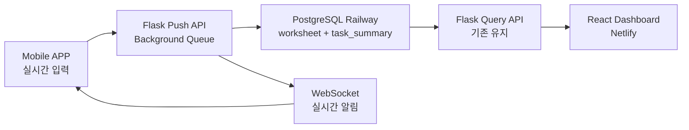
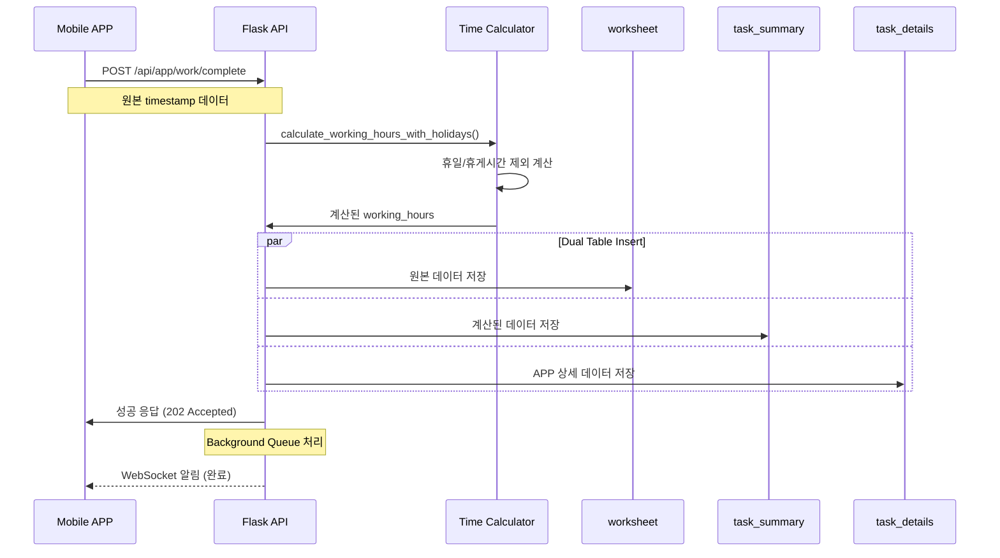
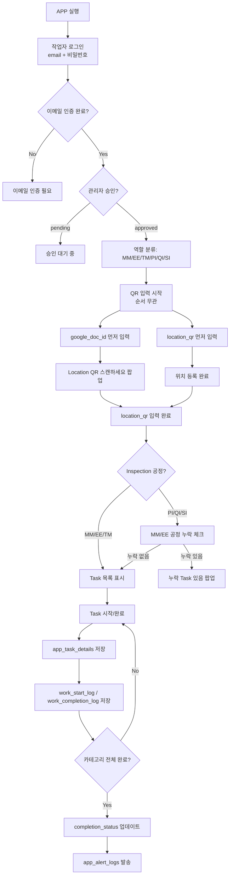

# 📊 GST Factory PDA 프로젝트 종합 분석 및 실행 계획

> **작성일**: 2026-01-12
> **목표**: 2026 Q2-Q3 APP 개발 완료
> **현재 상태**: Flutter 앱 기본 구조 완성, Backend API 구현 필요

---

## 📋 목차

1. [프로젝트 개요](#1-프로젝트-개요)
2. [현재 상태 분석](#2-현재-상태-분석)
3. [아키텍처 설계](#3-아키텍처-설계)
4. [구현 현황](#4-구현-현황)
5. [실행 계획 (Q2-Q3 2026)](#5-실행-계획-q2-q3-2026)
6. [기술 스택](#6-기술-스택)
7. [리스크 및 대응 방안](#7-리스크-및-대응-방안)
8. [APP 실행 Task 순서 및 조건 체계](#8-app-실행-task-순서-및-조건-체계)
9. [ETL 파이프라인 및 QR 배포 체계](#9-etl-파이프라인-및-qr-배포-체계)
10. [예상 성과 및 ROI](#10-예상-성과-및-roi)
11. [다음 액션 아이템](#11-다음-액션-아이템)
12. [참고 문서](#12-참고-문서)
13. [DB 테이블 전환 분석 (PDA → App)](#13-db-테이블-전환-분석-pda--app)
14. [공식 브랜드 & 로고 체계](#14-공식-브랜드--로고-체계)

---

## 1. 프로젝트 개요

### 1.1 비즈니스 목표
**수동 스프레드시트 입력 → 모바일 APP 실시간 입력 전환**

| 항목 | 현재 (Sheets) | 목표 (APP) | 개선율 |
|------|--------------|-----------|---------|
| 입력 시간 | 5분/건 | 30초/건 | **90% ⬇️** |
| 데이터 누락 | 10-15% | <1% | **95% ⬇️** |
| 실시간성 | 배치 처리 (15-45초) | 즉시 (<500ms) | **실시간** |
| 사용자 만족도 | 60% | 95% 목표 | **58% ⬆️** |

### 1.2 핵심 기능

```yaml
작업자_관리:
  - MM (기구): 19개 작업 항목
  - EE (전장): 8개 작업 항목
  - II (검사): 4개 작업 항목
  - TMS 모듈제품 특화 로직

작업_흐름:
  1. Location QR 스캔 → 위치 등록
  2. Worksheet QR 스캔 → 작업자 역할 선택
  3. Task별 시작/완료 터치 → 실시간 Timestamp 기록
  4. 3단계 체크 (MM → EE → II)
  5. 누락 Task 알림 (팝업 + 전체 알림)

데이터_관리:
  - 로컬: SQLite (오프라인 지원)
  - 백엔드: Railway PostgreSQL
  - 실시간 동기화
```

---

## 2. 현재 상태 분석

### 2.1 시스템 아키텍처 비교

#### 기존 시스템 (Extract 방식)


**문제점**:
- ❌ 수동 입력 → 데이터 누락 10-15%
- ❌ 배치 처리 → 15-45초 지연
- ❌ subprocess 블로킹 → 동기식 처리
- ❌ DB 연결 매 요청마다 새로 생성

#### 목표 시스템 (APP Push 방식)


**개선점**:
- ✅ 실시간 입력 → 데이터 정확도 99%+
- ✅ 즉시 응답 (<500ms) → Background Queue 처리
- ✅ Connection Pool → 성능 10배 향상
- ✅ WebSocket 알림 → 사용자 경험 혁신

### 2.2 현재 문제 상황

```yaml
Railway_Staging:
  상태: 정상 운영 중 (Railway PostgreSQL)
  URL: maglev.proxy.rlwy.net:38813/railway
  용도: ETL 데이터 적재 + QR API 데이터소스
  현재: documents 6건, product_info 6건 (2025-12-01 기구시작일 테스트 데이터)
  변경: info→product_info, google_doc_id→qr_doc_id, DOC_{SN} 기반 채번

Flutter_앱:
  상태: 웹으로 실행 가능
  완성도: 80% (UI/로컬DB 완료)
  미완성: Backend API 연동

Backend_API:
  상태: Push API 미구현
  기존: 조회 API만 존재
  필요: 작업 시작/완료/위치 추적 API
```

---

## 3. 아키텍처 설계

### 3.1 Hybrid Architecture (REST + WebSocket)

#### 권장 프로토콜 전략
```yaml
Write_Operations: REST API
  - POST /api/app/work/start (작업 시작)
  - POST /api/app/work/complete (작업 완료)
  - POST /api/app/location/track (위치 추적)
  - 이유: 단순성, 안정성, 트랜잭션 보장

Read_Operations: REST API
  - GET /api/factory (대시보드 데이터)
  - GET /api/workers (작업자 조회)
  - 이유: 캐싱 효과, 호환성

Real-time_Notifications: WebSocket
  - 작업 완료 알림
  - 진행률 업데이트
  - 실시간 위치 변경
  - 이유: 사용자 경험 향상
```

### 3.2 데이터베이스 스키마

#### 기존 테이블 (재사용)
```sql
-- info: 제품 기본 정보
CREATE TABLE info (
    document_id VARCHAR(100) PRIMARY KEY,
    google_doc_id VARCHAR(100) UNIQUE,
    serial_number VARCHAR(100),
    model_name VARCHAR(200),
    location_qr_id VARCHAR(100),  -- APP에서 업데이트
    created_at TIMESTAMP DEFAULT CURRENT_TIMESTAMP,
    updated_at TIMESTAMP DEFAULT CURRENT_TIMESTAMP
);

-- worksheet: 작업 이력 (원본 데이터)
CREATE TABLE worksheet (
    worksheet_id SERIAL PRIMARY KEY,
    document_id INTEGER REFERENCES documents(document_id),
    task_name TEXT,
    start_time TIMESTAMP,
    end_time TIMESTAMP,
    task_category VARCHAR(50)
);

-- task_summary: 계산된 작업 시간
CREATE TABLE task_summary (
    task_summary_id SERIAL PRIMARY KEY,
    document_id INTEGER,
    serial_number VARCHAR(128),
    task_name VARCHAR(255),
    task_category VARCHAR(50),
    working_hours DOUBLE PRECISION,  -- calculate_working_hours() 결과
    total_working_time VARCHAR(20)
);
```

#### 신규 테이블 (APP 전용)
```sql
-- workers: 작업자 관리
CREATE TABLE workers (
    worker_id VARCHAR(50) PRIMARY KEY,
    phone_number VARCHAR(15) UNIQUE,
    name VARCHAR(50),
    role VARCHAR(10),  -- 'MM', 'EE', 'II'
    department VARCHAR(50),
    permissions JSONB,
    is_worksheet_manager BOOLEAN DEFAULT FALSE,
    created_at TIMESTAMP DEFAULT CURRENT_TIMESTAMP
);

-- location_history: 실시간 위치 추적
CREATE TABLE location_history (
    id SERIAL PRIMARY KEY,
    worker_id VARCHAR(50) REFERENCES workers(worker_id),
    serial_number VARCHAR(128),
    location_id VARCHAR(50),
    location_name VARCHAR(100),
    latitude DECIMAL(10, 8),
    longitude DECIMAL(11, 8),
    location_type VARCHAR(20),  -- 'work_site', 'inspection_room'
    timestamp TIMESTAMP DEFAULT CURRENT_TIMESTAMP
);

-- task_details: APP 작업 상세 (로컬 DB와 동기화)
CREATE TABLE task_details (
    id SERIAL PRIMARY KEY,
    task_id VARCHAR(50) UNIQUE,
    serial_number VARCHAR(128),
    model VARCHAR(100),
    worker_id VARCHAR(50) REFERENCES workers(worker_id),
    task_category VARCHAR(50),  -- 'MECH', 'ELEC', 'INSPECTION'
    task_name VARCHAR(255),
    start_time TIMESTAMP,
    end_time TIMESTAMP,
    progress INTEGER DEFAULT 0,  -- 0-100
    notes TEXT,
    snapshot_url TEXT,  -- 작업 중 사진
    created_at TIMESTAMP DEFAULT CURRENT_TIMESTAMP,
    updated_at TIMESTAMP DEFAULT CURRENT_TIMESTAMP
);

-- concurrent_work: 동시 작업 관리
CREATE TABLE concurrent_work (
    id SERIAL PRIMARY KEY,
    task_id VARCHAR(50) UNIQUE,
    worker_id VARCHAR(50) REFERENCES workers(worker_id),
    serial_number VARCHAR(128),
    work_status VARCHAR(20),  -- 'started', 'in_progress', 'completed'
    start_time TIMESTAMP,
    end_time TIMESTAMP,
    location VARCHAR(100),
    updated_at TIMESTAMP DEFAULT CURRENT_TIMESTAMP
);

-- alert_logs: 알림 로그
CREATE TABLE alert_logs (
    id SERIAL PRIMARY KEY,
    serial_number VARCHAR(128),
    alert_type VARCHAR(50),  -- 'task_missing', 'location_required'
    triggered_by VARCHAR(50),  -- worker_id
    sent_to TEXT[],  -- 수신자 목록 (배열)
    details JSONB,
    timestamp TIMESTAMP DEFAULT CURRENT_TIMESTAMP,
    resolved BOOLEAN DEFAULT FALSE
);

-- offline_queue: 오프라인 동기화 큐
CREATE TABLE offline_queue (
    id SERIAL PRIMARY KEY,
    worker_id VARCHAR(50),
    request_type VARCHAR(50),  -- 'work_start', 'work_complete', 'location_track'
    request_data JSONB,
    sync_status VARCHAR(20) DEFAULT 'pending',  -- 'pending', 'synced', 'failed'
    created_at TIMESTAMP DEFAULT CURRENT_TIMESTAMP,
    synced_at TIMESTAMP
);
```

### 3.3 데이터 플로우

#### APP → Backend 데이터 흐름


#### 시간 계산 로직 (기존 활용)
```python
# utils/time_utils.py - calculate_working_hours_with_holidays()
핵심_로직:
  - 휴일 제외 (config/settings.py HOLIDAYS)
  - 근무시간 적용:
    * 평일: 08:00-20:00 (12시간)
    * 주말: 08:00-17:00 (9시간)
  - 휴게시간 제외:
    * 점심: 12:00-13:00
    * 저녁: 18:00-18:30
    * 휴식: 기타 설정된 시간
  - 일일 최대 작업시간:
    * 평일: 12시간
    * 주말: 9시간
```

---

## 4. 구현 현황

### 4.1 Flutter APP (80% 완료)

#### ✅ 완료된 기능
```yaml
로컬_데이터베이스:
  - SQLite 구현: task_details, completion_status, alert_logs
  - 오프라인 동기화: offline_queue 테이블
  - CRUD 로직: LocalDatabaseService

데이터_모델:
  - TaskItem: Task 데이터 모델
  - CompletionStatus: 완료 상태 모델
  - AlertLog: 알림 로그 모델
  - WorksheetInfo: 워크시트 정보 모델

API_통신:
  - ApiService: REST API 클라이언트
  - Mock 데이터 지원
  - 타임아웃 처리 (10초)
  - 에러 핸들링

UI_화면:
  - TestInputScreen: google_doc_id 입력
  - WorksheetDetailScreen: 워크시트 상세 정보
  - TaskManagementScreen: Task 관리 (드롭다운 + 터치)
  - 역할별 Task 목록 표시

작업자_역할:
  - MM (기구): 19개 Task (실제 PDA 목록)
  - EE (전장): 8개 Task (실제 PDA 목록)
  - II (검사): 4개 Task (실제 PDA 목록)
  - TMS 모듈제품 분기 로직
```

#### ❌ 미완성 기능
```yaml
Backend_연동:
  - Push API 엔드포인트 미구현
  - 실시간 동기화 테스트 미완료
  - WebSocket 연결 미구현

체크_로직:
  - 3단계 체크 (MM → EE → II) 미구현
  - 누락 Task 알림 팝업 미완성
  - 전체 알림 시스템 미구현

QR_스캔:
  - MLKit 제거 후 복원 안 됨
  - 수동 입력으로 대체 중
  - Apple Developer Program 승인 대기
```

### 4.2 Backend API (20% 완료)

#### ✅ 기존 API (조회 전용)
```python
# Flask API (4,648줄 단일 파일)
GET /api/worksheet-info?google_doc_id={id}
  - worksheet 정보 조회
  - task_timestamps 포함
  - 응답시간: 200-500ms

POST /api/update-location-qr
  - location_qr_id 업데이트
  - info 테이블 수정
```

#### ❌ 필요한 Push API (미구현)
```python
# 작업 관리
POST /api/app/work/start
  - 작업 시작 기록
  - concurrent_work + task_details 생성
  - 중복 작업 체크

PUT /api/app/work/update
  - 진행률 업데이트
  - progress 0-100
  - 실시간 상태 변경

POST /api/app/work/complete
  - 작업 완료 (핵심 API)
  - worksheet + task_summary + task_details 동시 저장
  - calculate_working_hours() 호출
  - Background Queue 처리

# 작업자 관리
POST /api/app/worker/register
  - 작업자 등록
  - 역할 설정 (MM/EE/II)

# 위치 추적
POST /api/app/location/track
  - 실시간 위치 기록
  - location_history 저장

# 동기화
GET /api/app/sync?last_sync_time={timestamp}&worker_id={id}
  - APP ↔ Server 동기화
  - 미동기화 데이터 조회
```

### 4.3 인프라 현황

```yaml
Production:
  - Railway: https://gst-factory-backend.railway.app
  - 상태: 정상 작동
  - DB: PostgreSQL (유료 플랜)
  - API: Flask (4,648줄)

Staging:
  - Railway: maglev.proxy.rlwy.net:38813/railway (정상 운영)
  - ETL 파이프라인으로 Teams Excel → DB 적재 완료
  - Flask 서버: localhost:5001 (QR API + 다운로드 페이지)

Frontend:
  - React Dashboard: Netlify
  - 상태: 정상 작동
  - 기존 API 연동 완료
```

---

## 5. 실행 계획 (Q2-Q3 2026)

### 5.1 Timeline Overview

```yaml
Q2_2026 (4-6월):
  Week_1-2 (4월 초):
    - Staging 환경 구축
    - Flask Push API 구현
    - DB 스키마 마이그레이션

  Week_3-4 (4월 중):
    - Flutter 앱 Backend 연동
    - 오프라인 동기화 테스트
    - 3단계 체크 로직 구현

  Week_5-8 (5월):
    - 통합 테스트
    - 성능 최적화
    - 사용자 피드백 반영

  Week_9-12 (6월):
    - Beta 테스트 (10-20명)
    - 버그 수정 및 안정화
    - 문서화

Q3_2026 (7-9월):
  Week_1-4 (7월):
    - Production 배포 준비
    - 보안 검토
    - 최종 성능 튜닝

  Week_5-8 (8월):
    - Production 배포 (점진적)
    - 모니터링 및 알림 시스템
    - 사용자 교육

  Week_9-12 (9월):
    - 전체 전환 완료
    - 기존 Extract 시스템 병행 운영
    - 안정화 및 개선
```

### 5.2 Phase별 상세 계획

#### Phase 1: Staging 환경 구축 (2주, 4월 초)

**목표**: 개발 및 테스트 환경 완성

```yaml
Week_1:
  - [ ] Staging DB 선택 및 구축
    * Option A: Supabase (추천) → 무료 500MB, 웹 UI
    * Option B: Neon → 무료 3GB, Serverless
    * Option C: 로컬 PostgreSQL + ngrok → 제약 없음

  - [ ] DB 스키마 마이그레이션
    * sql/migration_001_core_tables.sql 실행
    * 신규 테이블 생성: workers, location_history
    * 인덱스 추가 및 최적화

  - [ ] 샘플 데이터 삽입
    * 작업자 10명 (MM 4명, EE 3명, II 3명)
    * 제품 5개 (다양한 모델)
    * Task 30개 (진행 중, 완료 혼합)

Week_2:
  - [ ] Flask Push API 기본 구조
    * api/app_push_api.py 생성
    * Connection Pool 설정 (min=5, max=30)
    * CORS 설정 (Flutter 웹 테스트)

  - [ ] 핵심 API 구현 (3개)
    * POST /api/app/work/start
    * POST /api/app/work/complete (worksheet + task_summary 동시 저장)
    * POST /api/app/location/track

  - [ ] API 테스트
    * Postman 테스트 스크립트
    * 응답시간 < 500ms 검증
    * 에러 핸들링 확인
```

#### Phase 2: APP-Backend 연동 (2주, 4월 중)

**목표**: Flutter 앱과 API 완전 연동

```yaml
Week_3:
  - [ ] API Service 업데이트
    * lib/services/api_service.dart 확장
    * completeWork() 메서드 구현
    * updateProgress() 메서드 구현
    * trackLocation() 메서드 구현

  - [ ] 오프라인 동기화 로직
    * SyncService 구현
    * 로컬 저장 → 서버 전송 플로우
    * 재시도 로직 (지수 백오프)
    * 충돌 해결 전략

Week_4:
  - [ ] 3단계 체크 로직 구현
    * MM Task 완료 → 기구 내 누락 체크
    * EE Task 완료 → 전장 내 누락 체크
    * II 검사 시작 → mech_completed && elec_completed 체크

  - [ ] 알림 시스템 구현
    * 누락 Task 팝업
    * 전체 알림 발송 (워크시트 관리 인원)
    * AlertLog 기록

  - [ ] UI 개선
    * 로딩 인디케이터
    * 에러 메시지 한글화
    * 동기화 상태 표시
```

#### Phase 3: 통합 테스트 및 최적화 (4주, 5월)

**목표**: 안정성 및 성능 검증

```yaml
Week_5-6:
  - [ ] 기능 테스트
    * 단일 작업 플로우 (Location → Worksheet → Task 완료)
    * 다중 작업자 동시 작업
    * 오프라인 → 온라인 동기화
    * 에러 시나리오 (네트워크 끊김, DB 장애)

  - [ ] 성능 테스트
    * 동시 사용자 50명 시뮬레이션
    * 응답시간 < 500ms 유지
    * 메모리 사용량 모니터링
    * DB Connection Pool 최적화

Week_7-8:
  - [ ] 사용자 피드백 반영
    * 내부 테스터 5-10명 모집
    * 피드백 수집 및 분석
    * UI/UX 개선

  - [ ] 문서화
    * API 문서 (Swagger/OpenAPI)
    * 사용자 가이드
    * 운영 매뉴얼
    * 트러블슈팅 가이드
```

#### Phase 4: Beta 테스트 (4주, 6월)

**목표**: 실제 현장 검증

```yaml
Week_9-10:
  - [ ] Beta 테스터 선정 (10-20명)
    * MM 작업자 5명
    * EE 작업자 3명
    * II 검사원 2명
    * 관리자 3명

  - [ ] Beta 테스트 시나리오
    * 일일 작업 플로우 (출근 → 작업 → 퇴근)
    * 주간 작업 패턴
    * 예외 상황 처리

  - [ ] 모니터링
    * 에러 로그 수집 (Sentry)
    * 성능 메트릭 (응답시간, 성공률)
    * 사용자 행동 분석

Week_11-12:
  - [ ] 버그 수정
    * Critical 버그 우선 처리
    * UI/UX 개선 사항 반영

  - [ ] 안정화
    * 메모리 누수 점검
    * DB 쿼리 최적화
    * 에러 핸들링 강화
```

#### Phase 5: Production 배포 (8주, 7-8월)

**목표**: 점진적 전환 및 안정화

```yaml
Week_1-2 (7월 초):
  - [ ] Production 환경 준비
    * Railway Production DB 스키마 업데이트
    * Flask API 코드 배포
    * 모니터링 대시보드 구축 (Grafana/New Relic)

  - [ ] Blue-Green 배포
    * Green 환경 (새 API) 구축
    * Blue 환경 (기존 API) 유지
    * 트래픽 0% → 10% 점진적 전환

Week_3-4 (7월 중):
  - [ ] 점진적 전환 (10% → 50%)
    * 초기 사용자 10명
    * 모니터링 및 이슈 대응
    * 50%까지 확대

  - [ ] 보안 검토
    * 인증/인가 체계 점검
    * 데이터 암호화 확인
    * 취약점 스캔

Week_5-6 (8월 초):
  - [ ] 전체 전환 (50% → 100%)
    * 모든 사용자 새 APP 사용
    * 기존 Extract 시스템 백업 운영

  - [ ] 사용자 교육
    * 작업자 교육 자료
    * 온보딩 가이드
    * FAQ 작성

Week_7-8 (8월 중):
  - [ ] 모니터링 및 알림
    * 에러 알림 (Slack/Email)
    * 성능 알림 (응답시간 > 1초)
    * 일일 리포트 자동 생성

  - [ ] 기존 시스템 병행 운영
    * Extract 시스템 1개월 병행
    * 데이터 일관성 검증
    * 점진적 폐기 계획
```

#### Phase 6: 안정화 및 개선 (4주, 9월)

**목표**: 완전 전환 및 고도화

```yaml
Week_9-10:
  - [ ] 완전 전환
    * Extract 시스템 폐기
    * 모든 데이터 APP 입력

  - [ ] 성능 개선
    * 병목 지점 분석
    * 쿼리 최적화
    * 캐싱 전략 적용

Week_11-12:
  - [ ] WebSocket 도입 (선택적)
    * Flask-SocketIO 설치
    * 실시간 알림 구현
    * 진행률 실시간 업데이트

  - [ ] 고도화 계획
    * 데이터 분석 대시보드
    * 예측 모델 (작업 시간)
    * 자동화 확대
```

### 5.3 마일스톤

| 날짜 | 마일스톤 | 산출물 | 성공 기준 |
|------|---------|--------|----------|
| **2026-04-15** | Staging 환경 완성 | Flask API + DB | API 응답시간 < 500ms |
| **2026-04-30** | APP-Backend 연동 | Flutter 앱 완성 | 오프라인 동기화 성공 |
| **2026-05-31** | 통합 테스트 완료 | 테스트 리포트 | 성능 목표 100% 달성 |
| **2026-06-30** | Beta 테스트 완료 | 사용자 피드백 | 만족도 85% 이상 |
| **2026-07-31** | Production 배포 | 점진적 전환 50% | 에러율 < 1% |
| **2026-08-31** | 전체 전환 완료 | 100% APP 사용 | 데이터 정확도 99%+ |
| **2026-09-30** | 안정화 완료 | 최종 리포트 | 사용자 만족도 95% |

---

## 6. 기술 스택

### 6.1 Frontend (Flutter APP)

```yaml
Framework: Flutter 3.x
  - 크로스 플랫폼 (iOS/Android/Web)
  - Hot Reload 개발 속도
  - Native 성능

State_Management: Riverpod 2.4.9
  - Provider 패턴
  - 반응형 UI
  - 테스트 용이성

Database: SQLite (sqflite 2.3.0)
  - 오프라인 지원
  - 로컬 데이터 저장
  - 동기화 큐 관리

HTTP: dio 5.4.0
  - REST API 통신
  - 인터셉터 지원
  - 타임아웃 처리

QR_Scan: qr_code_scanner 1.0.1
  - MLKit 없는 순수 Flutter
  - iOS/Android 호환
  - Apple Developer Program 승인 후 적용
```

### 6.2 Backend (Flask API)

```yaml
Framework: Flask 3.x
  - Python 3.10+
  - 기존 코드 재사용
  - 빠른 개발 속도

Database: PostgreSQL 15
  - Railway Cloud
  - Connection Pooling (psycopg2)
  - 트랜잭션 지원

Background_Queue:
  - Option A: Python Threading + Queue (초기)
  - Option B: Celery + Redis (확장)

Real-time: Flask-SocketIO (선택적)
  - WebSocket 지원
  - Room/Namespace 기능
  - Auto Fallback (Long Polling)

Monitoring:
  - Sentry (에러 트래킹)
  - Grafana (성능 모니터링)
  - Railway Dashboard (인프라)
```

### 6.3 Infrastructure

```yaml
Production:
  - Railway (Flask API + PostgreSQL)
  - Netlify (React Dashboard)
  - ngrok (개발 환경)

Staging:
  - Supabase / Neon / PlanetScale (DB)
  - 로컬 Flask API
  - ngrok (외부 노출)

CI/CD:
  - GitHub Actions
  - 자동 테스트
  - 자동 배포 (Staging/Production)

Monitoring:
  - Sentry (에러 알림)
  - Slack Integration
  - 일일 리포트 자동화
```

---

## 7. 리스크 및 대응 방안

### 7.1 기술적 리스크

| 리스크 | 영향 | 확률 | 대응 방안 |
|--------|------|------|----------|
| **Railway Staging 무료 제한** | High | 100% | Supabase/Neon 대안 사용 |
| **QR 스캔 미구현** | Medium | 70% | 수동 입력으로 대체, MLKit 복원 계획 |
| **WebSocket 성능 문제** | Low | 30% | Polling 대체, Flask-SocketIO 최적화 |
| **DB 연결 풀 고갈** | Medium | 40% | Connection Pool 크기 동적 조정 |
| **오프라인 동기화 실패** | High | 50% | 재시도 로직 + 충돌 해결 알고리즘 |

### 7.2 일정 리스크

| 리스크 | 영향 | 확률 | 대응 방안 |
|--------|------|------|----------|
| **Q2 목표 미달성** | High | 40% | Phase별 우선순위 조정, 최소 기능 먼저 |
| **Beta 테스트 지연** | Medium | 50% | 테스터 사전 모집, 시나리오 사전 준비 |
| **Production 배포 지연** | Medium | 30% | Blue-Green 배포로 롤백 가능, 점진적 전환 |

**대응 전략**:
```yaml
최소_기능_우선 (MVP):
  - Phase 1-2: 핵심 기능 (작업 시작/완료)
  - Phase 3-4: 오프라인 동기화
  - Phase 5-6: 실시간 알림 (선택적)

유연한_일정:
  - Q2 → 핵심 기능 완성
  - Q3 → 고도화 및 안정화
  - Q4 → WebSocket 등 추가 기능
```

### 7.3 비즈니스 리스크

| 리스크 | 영향 | 확률 | 대응 방안 |
|--------|------|------|----------|
| **사용자 저항** | High | 40% | 교육 강화, 점진적 전환, 인센티브 |
| **데이터 품질 저하** | High | 20% | 유효성 검증 강화, 실시간 피드백 |
| **기존 시스템과 충돌** | Medium | 30% | 병행 운영, 데이터 일관성 검증 |

**대응 전략**:
```yaml
사용자_중심:
  - 사용자 교육 (1주일 사전 교육)
  - 온보딩 가이드 (앱 내 튜토리얼)
  - 헬프데스크 운영 (초기 1개월)

데이터_품질:
  - 입력 검증 (클라이언트 + 서버)
  - 실시간 피드백 (잘못된 입력 즉시 알림)
  - 데이터 모니터링 (일일 품질 리포트)
```

---

## 8. APP 실행 Task 순서 및 조건 체계

### 8.1 전체 워크플로우 ⭐ Production PDA 기준



**🔄 Production PDA와의 주요 차이점:**
- **순서 무관 입력**: location_qr ↔ google_doc_id 순서 자유
- **6개 역할**: MM, EE, TM(TMS반제품), PI(가압검사), QI(공정검사), SI(출하검사)
- **이메일 인증 + 관리자 승인**: 2단계 계정 활성화
- **Inspection 공정 누락 체크**: PI/QI/SI가 작업 시작 전 MM/EE 완료 여부 확인

### 8.2 상세 Task 실행 순서

#### **Step 1: 작업자 로그인 (document_id)**

```yaml
입력:
  - document_id (작업자 고유 ID)
  - 비밀번호 (선택적)

처리:
  1. workers 테이블 조회
  2. classifier 컬럼으로 역할 확인
     - classifier = 'MM' → 기구 작업자
     - classifier = 'EE' → 전장 작업자
     - classifier = 'II' → 검사 작업자
  3. 권한 검증 (permissions JSONB)

출력:
  - 작업자 정보 (name, classifier, permissions)
  - 앱 세션에 역할 저장

SQL:
  SELECT document_id, name, classifier, permissions
  FROM workers
  WHERE document_id = %s;
```

#### **Step 2: Worksheet QR 스캔 → Metadata 추출**

```yaml
입력:
  - Worksheet QR 코드 스캔
  - QR 데이터: "google_doc_id: DOC_GBWS-0GlUkIl0"

처리:
  1. QR 데이터 파싱 → google_doc_id 추출
  2. Spreadsheet 정보판에서 Metadata 추출:
     - serial_number (제품 S/N)
     - model_name (모델명)
     - mech_partner (기구 협력사)
     - elec_partner (전장 협력사)
     - module_outsourcing ('TMS' 또는 '없음')
     - manufacturing_start, manufacturing_end
     - spreadsheet_link

출력:
  - Metadata 객체 (메모리 저장)
```

#### **Step 3: SQL info 테이블 적재**

```yaml
처리:
  - info 테이블에 Metadata INSERT/UPDATE
  - google_doc_id를 Unique Key로 사용
  - 이미 존재하면 updated_at만 갱신

SQL:
  INSERT INTO info (
    google_doc_id, serial_number, model_name,
    mech_partner, elec_partner, module_outsourcing,
    manufacturing_start, manufacturing_end,
    spreadsheet_link, created_at
  ) VALUES (%s, %s, %s, %s, %s, %s, %s, %s, %s, NOW())
  ON CONFLICT (google_doc_id)
  DO UPDATE SET
    serial_number = EXCLUDED.serial_number,
    model_name = EXCLUDED.model_name,
    updated_at = NOW();

출력:
  - Metadata 저장 완료
```

#### **Step 4: Location QR 촬영 → info.location_qr_id 저장**

```yaml
입력:
  - Location QR 코드 스캔
  - QR 데이터: "LOC-A01" (검사실 위치)

처리:
  1. Location QR 데이터 파싱 → location_id 추출
  2. info 테이블 UPDATE (location_qr_id 컬럼)

SQL:
  UPDATE info
  SET location_qr_id = %s,
      updated_at = NOW()
  WHERE google_doc_id = %s;

출력:
  - "검사실 A01 위치로 등록되었습니다" 메시지

API_엔드포인트 (기존 재사용):
  POST /api/update-location-qr
  Body: {
    "google_doc_id": "DOC_GBWS-0GlUkIl0",
    "location_qr_id": "LOC-A01"
  }
```

#### **Step 5: 역할별 Task 목록 조회 및 화면 출력**

```yaml
입력:
  - 작업자 classifier (MM/EE/II)
  - google_doc_id (현재 Worksheet)
  - mech_partner, module_outsourcing (TMS 분기용)

처리:
  1. classifier에 따라 Task 목록 선택:
     - MM → 19개 기구 Task
     - EE → 8개 전장 Task
     - II → 4개 검사 Task

  2. TMS 모듈제품 분기 로직 (MM만 해당):
     IF mech_partner == "TMS" AND module_outsourcing == "TMS":
       Task 목록 = TMS 모듈 Task (5개)
     ELSE:
       Task 목록 = 일반 기구 Task (19개)

  3. 기존 진행 상태 복원:
     - task_details 테이블에서 started_at, completed_at 조회
     - 이미 시작/완료된 Task 상태 반영

출력:
  - Task 관리 화면 표시
  - [
      {id: 1, name: "CABINET ASSY", started: false, completed: false},
      {id: 2, name: "BURNER ASSY(TMS)", started: true, completed: false},
      ...
    ]
```

**MM (기구) - 19개 Task**:
```yaml
실제_PDA_Task_목록:
  1. CABINET ASSY
  2. BURNER ASSY(TMS)
  3. WET TANK ASSY(TMS)
  4. 3-WAY VALVE ASSY
  5. N2 LINE ASSY
  6. N2 TUBE ASSY
  7. CDA LINE ASSY
  8. CDA TUBE ASSY
  9. BCW LINE ASSY
  10. PCW LINE ASSY
  11. O2 LINE ASSY
  12. LNG LINE ASSY
  13. WASTE GAS LINE ASSY
  14. COOLING UNIT(TMS)
  15. REACTOR ASSY(TMS)
  16. HEATING JACKET
  17. CIR LINE TUBING
  18. 설비 CLEANING
  19. 자주검사 ⭐ (완료 기준 Task)

TMS_모듈제품_분기:
  조건: mech_partner == "TMS" && module_outsourcing == "TMS"
  Task_목록:
    1. BURNER ASSY(TMS)
    2. WET TANK ASSY(TMS)
    3. COOLING UNIT(TMS)
    4. REACTOR ASSY(TMS)
    5. 가압검사 (추가)
```

**EE (전장) - 8개 Task**:
```yaml
실제_PDA_Task_목록:
  1. 판넬 제작 작업
  2. 케비넷 준비 작업(덕트, 철거작업)
  3. 판넬 취부 및 선분리
  4. 내, 외부 작업
  5. 탱크 작업
  6. 판넬 작업
  7. 탱크 도킹 후 결선 작업
  8. 검수 ⭐ (완료 기준 Task)
```

**II (검사) - 4개 Task**:
```yaml
실제_PDA_Task_목록:
  1. LNG/Util
  2. LNG
  3. Chamber
  4. I/O 체크, 가동 검사, 전장 마무리 ⭐ (완료 기준 Task)
```

#### **Step 6: Task 시작/완료 처리**

```yaml
시작_버튼_클릭:
  로컬_저장:
    - task_details 테이블
      * task_id, task_name, started_at (현재 시간)
      * worker_id, serial_number

  서버_전송 (온라인):
    - POST /api/app/work/start
      Body: {
        task_id, worker_id, serial_number,
        task_name, start_time (ISO 8601)
      }

완료_버튼_클릭:
  로컬_저장:
    - task_details 테이블
      * completed_at (현재 시간)
      * duration (종료-시작)

  서버_전송 (온라인):
    - POST /api/app/work/complete
      Body: {
        task_id, worker_id, serial_number,
        task_name, start_time, end_time
      }

  서버_처리:
    1. calculate_working_hours_with_holidays() 호출
    2. worksheet 테이블 저장 (원본 timestamp)
    3. task_summary 테이블 저장 (계산된 working_hours)
```

#### **Step 7: 완료 상태 체크 및 알림**

**MM 작업자 완료 체크**:
```javascript
// 모든 MM Task 완료 확인
const allMechTasksCompleted = mechTasks.every(task => task.completed);

if (allMechTasksCompleted) {
  // completion_status 업데이트
  UPDATE completion_status
  SET mech_completed = TRUE,
      mech_completed_at = NOW()
  WHERE serial_number = 'SN-2025-001';

  // 알림 발송
  sendNotification({
    type: 'mech_completed',
    serial_number: 'SN-2025-001',
    worker_id: 'MM001',
    sent_to: ['II_TEAM', 'WORKSHEET_MANAGERS']
  });
}
```

**EE 작업자 완료 체크**:
```javascript
const allElecTasksCompleted = elecTasks.every(task => task.completed);

if (allElecTasksCompleted) {
  UPDATE completion_status
  SET elec_completed = TRUE,
      elec_completed_at = NOW()
  WHERE serial_number = 'SN-2025-001';

  sendNotification({
    type: 'elec_completed',
    serial_number: 'SN-2025-001',
    worker_id: 'EE001',
    sent_to: ['II_TEAM', 'WORKSHEET_MANAGERS']
  });
}
```

**II 직원 검사 시작 전 체크**:
```javascript
// II가 Worksheet QR 스캔 시
const status = getCompletionStatus(serialNumber);

// 3단계 체크
const checks = {
  mechCompleted: status.mech_completed,
  elecCompleted: status.elec_completed,
  locationQRScanned: status.location_qr_id !== null
};

// 누락 체크
if (!checks.mechCompleted) {
  showAlert({
    type: 'warning',
    title: '⚠️ 기구 작업 누락 발생',
    message: 'MM 관리자에게 알림이 발송되었습니다.',
    actions: ['확인']
  });

  sendAlert({
    serial_number: serialNumber,
    alert_type: 'task_missing_mech',
    triggered_by: currentWorkerId,
    sent_to: ['MM_MANAGER', 'WORKSHEET_MANAGERS']
  });
}

if (!checks.elecCompleted) {
  showAlert({
    type: 'warning',
    title: '⚠️ 전장 작업 누락 발생',
    message: 'EE 관리자에게 알림이 발송되었습니다.',
    actions: ['확인']
  });

  sendAlert({
    serial_number: serialNumber,
    alert_type: 'task_missing_elec',
    triggered_by: currentWorkerId,
    sent_to: ['EE_MANAGER', 'WORKSHEET_MANAGERS']
  });
}

if (!checks.locationQRScanned) {
  showAlert({
    type: 'info',
    title: '📍 검사 위치 등록 필요',
    message: 'Location QR을 먼저 촬영하세요',
    actions: ['Location QR 촬영하기', '나중에']
  });
}

// 모든 조건 충족 시
if (checks.mechCompleted && checks.elecCompleted && checks.locationQRScanned) {
  // 검사 작업 진행 허용
  allowInspectionTasks();
}
```

### 8.3 데이터베이스 스키마 (APP 관련)

#### **1. workers 테이블 (작업자 관리) ⭐ Production PDA 기준**

```sql
CREATE TABLE workers (
    id SERIAL PRIMARY KEY,
    worker_id VARCHAR(50) UNIQUE NOT NULL,    -- ⭐ MM001, EE001, TM001, PI001, QI001, SI001
    name VARCHAR(100) NOT NULL,
    role VARCHAR(20) NOT NULL,                -- ⭐ MM, EE, TM, PI, QI, SI (6개 카테고리)
    department VARCHAR(50),                   -- 소속
    phone VARCHAR(20),
    email VARCHAR(100) UNIQUE NOT NULL,       -- ⭐ 로그인 ID (이메일)

    -- 이메일 인증
    email_verified BOOLEAN DEFAULT false,
    email_verified_at TIMESTAMP,

    -- 관리자 승인
    approval_status VARCHAR(20) DEFAULT 'pending',  -- pending, approved, rejected
    approved_by VARCHAR(50),
    approved_at TIMESTAMP,

    -- 권한
    is_manager BOOLEAN DEFAULT false,         -- ⭐ 협력사 관리자 (Task 삭제 권한)
    -- PI, QI, SI 역할은 자동으로 사내직원 권한

    -- 상태
    is_active BOOLEAN DEFAULT false,

    created_at TIMESTAMP DEFAULT CURRENT_TIMESTAMP,
    updated_at TIMESTAMP DEFAULT CURRENT_TIMESTAMP,

    CONSTRAINT chk_role CHECK (role IN ('MM', 'EE', 'TM', 'PI', 'QI', 'SI')),
    CONSTRAINT chk_approval CHECK (approval_status IN ('pending', 'approved', 'rejected'))
);

-- 인덱스
CREATE INDEX idx_workers_role ON workers(role);
CREATE INDEX idx_workers_email ON workers(email);
CREATE INDEX idx_workers_approval ON workers(approval_status);
CREATE INDEX idx_workers_manager ON workers(is_manager) WHERE is_manager = true;
```

**🔑 권한 체계:**
| 역할 | is_manager | 사내직원 | Task 삭제 가능 |
|------|------------|----------|---------------|
| MM 작업자 | false | ❌ | ❌ |
| MM 관리자 | true | ❌ | ✅ |
| EE 작업자 | false | ❌ | ❌ |
| EE 관리자 | true | ❌ | ✅ |
| TM 작업자 | false | ❌ | ❌ |
| PI/QI/SI | - | ✅ (자동) | ✅ |

#### **2. email_verification 테이블 (이메일 인증) 🆕**

```sql
CREATE TABLE email_verification (
    id SERIAL PRIMARY KEY,
    email VARCHAR(100) NOT NULL,
    verification_code VARCHAR(6) NOT NULL,    -- 6자리 인증번호
    expires_at TIMESTAMP NOT NULL,            -- 만료 시간 (10분)
    verified BOOLEAN DEFAULT false,
    created_at TIMESTAMP DEFAULT CURRENT_TIMESTAMP
);

CREATE INDEX idx_email_verification_email ON email_verification(email);
CREATE INDEX idx_email_verification_expires ON email_verification(expires_at);
```

#### **3. location_history 테이블 (위치 이력) 🆕**

```sql
CREATE TABLE location_history (
    id SERIAL PRIMARY KEY,
    worker_id VARCHAR(50) NOT NULL,
    serial_number VARCHAR(128),               -- 작업 중인 제품 S/N
    google_doc_id VARCHAR(100),               -- 제품 QR ID

    -- QR 기반 (주)
    qr_location_id VARCHAR(100),              -- 위치 QR 코드 ID
    location_name VARCHAR(100),               -- 위치명

    -- GPS 기반 (보조)
    latitude DECIMAL(10,8),
    longitude DECIMAL(11,8),

    -- 공정 정보
    process_type VARCHAR(20),                 -- MM, EE, TM, PI, QI, SI

    timestamp TIMESTAMP NOT NULL,
    created_at TIMESTAMP DEFAULT CURRENT_TIMESTAMP,

    CONSTRAINT fk_location_worker
        FOREIGN KEY (worker_id) REFERENCES workers(worker_id)
);

CREATE INDEX idx_location_worker ON location_history(worker_id);
CREATE INDEX idx_location_serial ON location_history(serial_number);
CREATE INDEX idx_location_google_doc ON location_history(google_doc_id);
CREATE INDEX idx_location_timestamp ON location_history(timestamp);
```

#### **4. info 테이블 (Worksheet Metadata + Location)**

```sql
-- 기존 테이블 활용 (location_qr_id 컬럼 포함)
CREATE TABLE info (
    document_id VARCHAR(100) PRIMARY KEY,
    google_doc_id VARCHAR(100) UNIQUE,       -- Worksheet QR ID
    serial_number VARCHAR(100),              -- 제품 S/N
    model_name VARCHAR(200),                 -- 모델명
    mech_partner VARCHAR(200),               -- 기구 협력사
    elec_partner VARCHAR(200),               -- 전장 협력사
    module_outsourcing VARCHAR(50),          -- 'TMS' 또는 '없음' (TMS 분기용)
    manufacturing_start DATE,
    manufacturing_end DATE,
    spreadsheet_link TEXT,
    location_qr_id VARCHAR(100),             -- ⭐ Location QR 저장 (Step 4)
    created_at TIMESTAMP DEFAULT CURRENT_TIMESTAMP,
    updated_at TIMESTAMP DEFAULT CURRENT_TIMESTAMP
);

-- 인덱스
CREATE INDEX idx_info_google_doc_id ON info(google_doc_id);
CREATE INDEX idx_info_location_qr ON info(location_qr_id);
CREATE INDEX idx_info_serial_number ON info(serial_number);
```

#### **5. app_task_details 테이블 (APP 작업 상세) ⭐ Production PDA**

```sql
CREATE TABLE app_task_details (
    id SERIAL PRIMARY KEY,
    serial_number VARCHAR(128) NOT NULL,      -- 제품 S/N
    google_doc_id VARCHAR(100),               -- 제품 QR ID
    task_category VARCHAR(20) NOT NULL,       -- MM, TM, EE, PI, QI, SI
    task_id INTEGER NOT NULL,                 -- Task 순번 (1, 2, 3...)
    task_name TEXT NOT NULL,                  -- Task 이름 (task_classifier.py 기준)

    started_at TIMESTAMP,                     -- 시작 시간
    completed_at TIMESTAMP,                   -- 완료 시간
    worker_id VARCHAR(50) NOT NULL,           -- 작업자 ID
    qr_location_id VARCHAR(100),              -- 작업 위치 QR

    notes TEXT,                               -- 비고
    images JSONB,                             -- 사진 (Phase 2)

    -- Task 비활성화 (관리자/사내직원 전용)
    is_applicable BOOLEAN DEFAULT true,       -- Task 적용 여부
    deleted_at TIMESTAMP,                     -- 비활성화 시간
    deleted_by VARCHAR(50),                   -- 비활성화한 worker_id

    created_at TIMESTAMP DEFAULT CURRENT_TIMESTAMP,
    updated_at TIMESTAMP DEFAULT CURRENT_TIMESTAMP,

    CONSTRAINT fk_task_worker
        FOREIGN KEY (worker_id) REFERENCES workers(worker_id),
    CONSTRAINT unique_task
        UNIQUE (serial_number, task_category, task_id)
);

CREATE INDEX idx_app_task_serial ON app_task_details(serial_number);
CREATE INDEX idx_app_task_google_doc ON app_task_details(google_doc_id);
CREATE INDEX idx_app_task_category ON app_task_details(task_category);
CREATE INDEX idx_app_task_worker ON app_task_details(worker_id);
CREATE INDEX idx_app_task_incomplete ON app_task_details(serial_number, task_category)
    WHERE completed_at IS NULL AND is_applicable = true;
CREATE INDEX idx_app_task_applicable ON app_task_details(serial_number)
    WHERE is_applicable = true;
```

**📝 Task 카테고리별 개수 (Production PDA 기준):**
- **MM (기구)**: 15개 (TMS 제외)
- **TM (TMS반제품)**: 4개
- **EE (전장)**: 8개
- **PI (가압검사)**: 3개 (LNG/Util, LNG, Chamber)
- **QI (공정검사)**: 1개 (I/O 체크, 가동 검사, 전장 마무리)
- **SI (출하검사)**: 4개 (Step 1~4)

#### **6. completion_status 테이블 (완료 상태) ⭐ Production PDA**

```sql
CREATE TABLE completion_status (
    id SERIAL PRIMARY KEY,
    serial_number VARCHAR(128) UNIQUE NOT NULL,
    google_doc_id VARCHAR(100),

    -- 카테고리별 완료 상태
    mm_completed BOOLEAN DEFAULT false,
    mm_completed_at TIMESTAMP,
    mm_worker_id VARCHAR(50),

    tm_completed BOOLEAN DEFAULT false,
    tm_completed_at TIMESTAMP,
    tm_worker_id VARCHAR(50),

    ee_completed BOOLEAN DEFAULT false,
    ee_completed_at TIMESTAMP,
    ee_worker_id VARCHAR(50),

    pi_completed BOOLEAN DEFAULT false,
    pi_completed_at TIMESTAMP,
    pi_worker_id VARCHAR(50),

    qi_completed BOOLEAN DEFAULT false,
    qi_completed_at TIMESTAMP,
    qi_worker_id VARCHAR(50),

    si_completed BOOLEAN DEFAULT false,
    si_completed_at TIMESTAMP,
    si_worker_id VARCHAR(50),

    -- 전체 완료
    all_completed BOOLEAN DEFAULT false,
    all_completed_at TIMESTAMP,

    created_at TIMESTAMP DEFAULT CURRENT_TIMESTAMP,
    updated_at TIMESTAMP DEFAULT CURRENT_TIMESTAMP
);

CREATE INDEX idx_completion_serial ON completion_status(serial_number);
CREATE INDEX idx_completion_google_doc ON completion_status(google_doc_id);
CREATE INDEX idx_completion_all ON completion_status(all_completed) WHERE all_completed = false;
```

#### **7. app_alert_logs 테이블 (APP 알림) ⭐ Production PDA**

```sql
CREATE TABLE app_alert_logs (
    id SERIAL PRIMARY KEY,
    alert_type VARCHAR(30) NOT NULL,          -- missing_task, approval_complete, approval_rejected, system
    target_worker_id VARCHAR(50),             -- 알림 대상 worker_id (NULL이면 전체)
    serial_number VARCHAR(128),               -- 관련 제품 S/N
    google_doc_id VARCHAR(100),               -- 관련 제품 QR

    title VARCHAR(200) NOT NULL,              -- 알림 제목
    message TEXT,                             -- 알림 내용
    metadata JSONB,                           -- 추가 데이터 (누락 task 목록 등)

    -- 읽음 상태
    is_read BOOLEAN DEFAULT false,
    read_at TIMESTAMP,

    -- 발신자 (missing_task인 경우 발견자)
    created_by VARCHAR(50),

    created_at TIMESTAMP DEFAULT CURRENT_TIMESTAMP,

    CONSTRAINT chk_alert_type CHECK (alert_type IN ('missing_task', 'approval_complete', 'approval_rejected', 'system'))
);

CREATE INDEX idx_alert_worker ON app_alert_logs(target_worker_id);
CREATE INDEX idx_alert_type ON app_alert_logs(alert_type);
CREATE INDEX idx_alert_unread ON app_alert_logs(target_worker_id, is_read) WHERE is_read = false;
CREATE INDEX idx_alert_serial ON app_alert_logs(serial_number);
```

#### **테이블 관계도**

```
workers (작업자)
    │
    │ document_id
    ▼
task_details (작업 상세) ←─── info (Metadata + Location)
    │                              │
    │                              │ google_doc_id
    ▼                              ▼
worksheet (원본 시간)        completion_status (완료 상태)
    │                              │
    ▼                              ▼
task_summary (계산된 시간)   alert_logs (알림 이력)
```

### 8.4 시간 계산 로직 (PDA에서 가져오기)

#### **기존 PDA calculate_working_hours 재사용**

```python
# PDA/utils/time_utils.py (그대로 사용)
from datetime import datetime, timedelta, time, date
import pandas as pd
from config.settings import (
    WORK_START, WORK_END, MAX_DAILY_HOURS,
    LUNCH_START, LUNCH_END,
    DINNER_START, DINNER_END,
    BREAK_1_START, BREAK_1_END,
    BREAK_2_START, BREAK_2_END,
    HOLIDAYS
)

def calculate_working_hours_with_holidays(start_time, end_time):
    """
    실제 작업 시간 계산 (휴일, 근무시간, 휴게시간 제외)

    Args:
        start_time (datetime): 작업 시작 시간
        end_time (datetime): 작업 종료 시간

    Returns:
        float: 실제 작업 시간 (시간 단위)

    처리 로직:
        1. 휴일 제외 (HOLIDAYS 리스트)
        2. 근무시간 적용:
           - 평일: 08:00-20:00 (12시간)
           - 주말: 08:00-17:00 (9시간)
        3. 휴게시간 제외:
           - 점심: 11:20-12:20
           - 저녁: 18:00-18:30
           - 휴식1, 휴식2 (설정 가능)
        4. 일일 최대 작업시간:
           - 평일: 12시간
           - 주말: 9시간
    """
    if pd.isna(start_time) or pd.isna(end_time):
        return 0

    total_hours = 0
    current_time = start_time

    while current_time < end_time:
        current_day = current_time.date()

        # 휴일 제외
        if current_day in HOLIDAYS:
            current_time = datetime.combine(
                current_day + timedelta(days=1),
                WORK_START
            )
            continue

        # 주말 판별 (>= 5: 토요일, 일요일 포함)
        is_weekend = current_day.weekday() >= 5
        work_start = datetime.combine(current_day, WORK_START)
        work_end = datetime.combine(
            current_day,
            time(17, 0) if is_weekend else WORK_END
        )

        actual_start = max(current_time, work_start)
        actual_end = min(end_time, work_end)

        if actual_start >= actual_end:
            current_time = datetime.combine(
                current_day + timedelta(days=1),
                WORK_START
            )
            continue

        work_seconds = (actual_end - actual_start).total_seconds()

        # 휴게시간 제외
        for b_start, b_end in [
            (LUNCH_START, LUNCH_END),
            (BREAK_1_START, BREAK_1_END),
            (BREAK_2_START, BREAK_2_END),
            (DINNER_START, DINNER_END)
        ]:
            break_start = datetime.combine(current_day, b_start)
            break_end = datetime.combine(current_day, b_end)
            if actual_start < break_end and break_start < actual_end:
                overlap = (
                    min(actual_end, break_end) -
                    max(actual_start, break_start)
                ).total_seconds()
                work_seconds -= max(0, overlap)

        # 일일 최대 작업시간 적용
        daily_limit = 9 if is_weekend else MAX_DAILY_HOURS
        total_hours += min(work_seconds / 3600, daily_limit)

        current_time = datetime.combine(
            current_day + timedelta(days=1),
            WORK_START
        )

    return total_hours
```

#### **설정 파일 (PDA/config/settings.py)**

```python
# 휴일 정의 (2025년 기준, 2026년으로 업데이트 필요)
HOLIDAYS = [
    date(2025, 1, 1),   # 신정
    date(2025, 1, 27),  # 설날 연휴
    date(2025, 1, 28),
    date(2025, 1, 29),
    date(2025, 3, 1),   # 삼일절
    date(2025, 5, 5),   # 어린이날
    date(2025, 5, 6),   # 대체공휴일
    date(2025, 6, 6),   # 현충일
    date(2025, 8, 15),  # 광복절
    date(2025, 10, 3),  # 개천절
    date(2025, 10, 6),  # 추석 연휴
    date(2025, 10, 7),
    date(2025, 10, 8),
    date(2025, 10, 9),
    date(2025, 12, 25)  # 크리스마스
]

# 근무 시간
WORK_START = time(8, 0)   # 08:00
WORK_END = time(20, 0)     # 20:00
MAX_DAILY_HOURS = 12       # 평일 최대 12시간

# 휴게시간
LUNCH_START = time(11, 20)
LUNCH_END = time(12, 20)
DINNER_START = time(18, 0)
DINNER_END = time(18, 30)
BREAK_1_START = time(10, 0)  # 필요시 설정
BREAK_1_END = time(10, 10)
BREAK_2_START = time(15, 0)
BREAK_2_END = time(15, 10)
```

#### **Flask Push API에서 사용**

```python
# Flask Push API (새로 구현)
from utils.time_utils import calculate_working_hours_with_holidays

@app.route('/api/app/work/complete', methods=['POST'])
def complete_work():
    """
    작업 완료 - worksheet + task_summary 동시 저장
    """
    data = request.json

    # 1. Timestamp 파싱
    start_time = datetime.fromisoformat(data['start_time'])
    end_time = datetime.fromisoformat(data['end_time'])

    # 2. 실제 작업 시간 계산 (PDA 로직 재사용)
    working_hours = calculate_working_hours_with_holidays(
        start_time,
        end_time
    )

    # 3. worksheet 테이블 저장 (원본)
    cursor.execute("""
        INSERT INTO worksheet
        (document_id, task_name, start_time, end_time, task_category)
        VALUES (%s, %s, %s, %s, %s)
    """, (
        data['document_id'],
        data['task_name'],
        start_time,
        end_time,
        data['task_category']
    ))

    # 4. task_summary 테이블 저장 (계산됨)
    cursor.execute("""
        INSERT INTO task_summary
        (document_id, serial_number, task_name, task_category,
         working_hours, total_working_time)
        VALUES (%s, %s, %s, %s, %s, %s)
    """, (
        data['document_id'],
        data['serial_number'],
        data['task_name'],
        data['task_category'],
        working_hours,
        format_hours(working_hours)  # "5:48" 형식
    ))

    conn.commit()

    return jsonify({
        'status': 'success',
        'working_hours': working_hours,
        'raw_duration': (end_time - start_time).total_seconds() / 3600
    }), 201
```

### 8.5 오프라인 동기화 로직

```yaml
오프라인_상태:
  로컬_저장:
    - SQLite task_details 테이블
    - offline_queue 테이블에 API 요청 대기
    - sync_status = 'pending'

온라인_복귀:
  자동_동기화:
    1. offline_queue에서 pending 데이터 조회
    2. 순차적으로 서버 전송
    3. 성공 시 sync_status = 'synced'
    4. 실패 시 재시도 (최대 3회)

충돌_해결:
  - 서버 우선 원칙 (Server Wins)
  - 로컬 데이터는 백업 유지
  - 사용자에게 충돌 알림 표시
```

### 8.6 예외 상황 처리

```yaml
중복_작업_방지:
  체크: concurrent_work 테이블 조회
  조건: worker_id + serial_number + work_status = 'in_progress'
  처리: "이미 진행 중인 작업입니다" 알림

시간_순서_오류:
  체크: end_time < start_time
  처리: "종료 시간이 시작 시간보다 빠릅니다" 알림

권한_없음:
  체크: worker.role과 task_category 불일치
  처리: "권한 없음: MM 작업자는 검사 작업 불가" 알림

네트워크_오류:
  처리:
    1. 로컬 저장
    2. 오프라인 큐에 추가
    3. "오프라인으로 저장되었습니다" 알림
    4. 자동 재시도 (백그라운드)
```

---

## 9. ETL 파이프라인 및 QR 배포 체계

### 9.1 ETL 파이프라인 개요

**기존 → 신규 전환:**
```
기존: Teams Excel → 수동 QR 워크시트(Google Sheets) 생성 → 종이 출력 → 수동 입력
신규: Teams Excel → ETL 자동 추출 → DB 적재 + doc_id 생성 → QR 이미지 발행 → APP 스캔
```

**핵심 변경점:**
- QR 워크시트(Google Sheets) **생성 단계 제거** — 종이 없는 프로세스
- doc_id는 Google Sheets에서 발급받는 것이 아니라 **시스템이 자동 채번**
- DB 적재 시점에 doc_id가 생성되므로 **Extract → Load가 2단계로 단순화**

### 9.2 ETL 데이터 흐름

```
Teams Excel (SCR 생산현황)          ← Source of Truth
       │
       │ ① Extract
       │   - Graph API로 Teams Excel 읽기
       │   - S/N, model_name, 날짜, 협력사 파싱
       ▼
  metadata 추출 완료
       │
       │ ② Load + Generate
       │   - DB INSERT (documents + info)
       │   - doc_id 자동 채번 (규칙: {프로젝트}_{모델코드}-{순번})
       ▼
  DB 적재 + doc_id 생성 완료
       │
       │ ③ QR 이미지 생성
       │   - doc_id → QR 이미지 (.png)
       │   - S/N + model_name 텍스트 포함 (육안 식별용)
       ▼
  QR 이미지 발행 완료
       │
       │ ④ 배포 (2가지 경로)
       ├─── 개별: 생산일정 대시보드에서 S/N 클릭 → QR 다운로드
       └─── 일괄: 날짜 필터 (기구시작일/전장시작일) → ZIP 다운로드
              │
              │ ⑤ 부착
              ▼
        현재: 이미지 출력 → 설비 부착
        추후: 라벨기 → 스티커 일괄 출력
              │
              │ ⑥ APP 사용
              ▼
        작업자 QR 스캔 → doc_id → DB 조회 → Task 표시
```

### 9.3 doc_id 채번 규칙

```
형식: DOC_{프로젝트코드}-{순번}
예시: DOC_GBWS-001, DOC_NFGE-012, DOC_SEMI-003

자동 채번 로직:
  1. Teams Excel에서 S/N + model_name 추출
  2. model_name → 프로젝트코드 매핑 (task_classifier 기준)
  3. 해당 프로젝트코드의 마지막 순번 조회 + 1
  4. doc_id 생성 및 DB 저장
```

### 9.4 QR 배포 체계

#### 개별 다운로드 (생산일정 대시보드)
```
생산일정 페이지 → S/N 행 → QR 다운로드 버튼 클릭
  → QR 이미지 다운로드 (doc_id + S/N 텍스트 포함)
```

#### 일괄 다운로드 (날짜 필터)
```
대시보드 → 일괄 QR 다운로드 메뉴
  → 필터: 기구시작일 / 전장시작일 기준
  → 기간 선택: "2026-01-10 ~ 2026-01-17"
  → ZIP 파일로 다운로드 (QR 이미지 여러 장)
  → 추후: 라벨기 연동하여 스티커 일괄 출력
```

### 9.5 접근 제어 (네트워크/위치 기반)

```
작업자 APP 태깅 시도
       │
       ├── 회사 WiFi IP 확인 ──── 허용 IP → 접근 허용
       │                          미허용 IP
       ├── GPS 위치 범위 확인 ─── 공장 범위 내 → 접근 허용
       │                          범위 외
       └── 접근 차단 (Task 화면 비노출)
           └── 관리자 임시 승인 기능 (사각지대 대비)
```

### 9.6 ETL 스크립트 구조 및 의존성

```
test_server/                          ← dev 프로젝트 (우리 ETL)
  ├── etl_pipeline/
  │   ├── step1_extract.py            # Teams Excel → metadata 파싱
  │   ├── step2_load.py               # DB INSERT + doc_id 채번
  │   ├── step3_qr_generate.py        # doc_id → QR 이미지 생성
  │   └── etl_main.py                 # 파이프라인 통합 실행
  ├── app.py                          # Flask 서버 (QR API 포함)
  ├── output/
  │   ├── qr_labels/                  # 생성된 QR 이미지 (.png)
  │   └── etl_result.json             # ETL 실행 결과 JSON
  └── static/
      └── qr_download.html            # QR 다운로드 샘플 페이지

/Users/kdkyu311/Desktop/GST/
  └── SCR-Schedule/                   ← 기존 프로젝트 (수정 금지)
      ├── src/
      │   ├── data_loader/
      │   │   └── excel_loader.py     # ExcelDataLoader (Teams Graph API)
      │   └── config.py               # 컬럼 매핑 (17개 컬럼)
      └── main.py                     # load_env_teams() 환경변수 로드
```

**핵심 의존성:**
- step1_extract.py는 SCR-Schedule의 `ExcelDataLoader`를 재사용
- `sys.path.insert(0, SCR_SCHEDULE_PATH)`로 모듈 import
- ExcelDataLoader가 Teams Graph API → Excel 다운로드 → DataFrame 파싱 수행
- `load_data()` 호출 시 **config.py column_mapping에 정의된 17개 컬럼만 추출**
- 추가 컬럼은 `loader._df` (raw DataFrame)에서 iloc 인덱스로 직접 접근 필요

**SCR-Schedule config.py 수정 금지 이유:**
- Production 대시보드가 QR worksheet '정보판' sheet에서 데이터를 extract하여 HTML 생성에 사용 중
- config.py 변경 시 대시보드 동작에 영향

### 9.7 ETL 컬럼 매핑 현황

**ExcelDataLoader 출력 (17개 컬럼, config.py 기준):**
| 표시명 | 원본 컬럼 | 인덱스 | ETL 매핑 | 상태 |
|--------|----------|--------|----------|------|
| S/N | S/N | 31 | serial_number | OK |
| 모델 | Model | 6 | model_name | OK |
| 오더번호 | 판매오더 | 2 | order_no | OK |
| 고객사 | 고객사 | 4 | customer | OK |
| 라인 | 라인 | 5 | line | **추가 필요** |
| 제품번호 | 제품번호 | 7 | product_code | **이름 수정 필요** |
| 기구업체 | 기구외주 | 39 | mech_partner | OK |
| 전장업체 | 전장외주 | 40 | elec_partner | OK |
| 기구시작 | 기구계획시작일 | 46 | mech_start | OK |
| 기구종료 | 기구계획종료일 | 48 | mech_end | OK |
| 전장시작 | 전장계획시작일 | 51 | elec_start | OK |
| 전장종료 | 전장계획종료일 | 52 | elec_end | OK |
| 가압시작 | 가압계획시작일 | 58 | pressure_test | OK |
| 자주검사 | 가동검사계획시작일 | 62 | self_inspect | OK |
| 공정시작 | TEST계획시작일 | 66 | process_inspect | OK |
| 마무리시작 | 마무리계획시작일 | 72 | finishing_start | OK |
| 출하 | 출고계획일 | 21 | planned_finish | OK |

**ExcelDataLoader 미포함 → `loader._df` iloc 직접 접근 필요:**
| DB 컬럼 | 원본 컬럼 | 인덱스(1-based) | 상태 |
|---------|----------|----------------|------|
| module_outsourcing | 모듈외주 | 41 (AO열) | _df 접근 필요 |
| semi_product_start | 모듈계획시작일 | 42 (AP열) | _df 접근 필요 |

**자동 생성 (Excel 원본 X):**
| DB 컬럼 | 생성 로직 | 상태 |
|---------|----------|------|
| title_number | `YYMMDD(기구시작)/판매오더/SN` 조합 | 구현 필요 |
| quantity | 항상 "1" (S/N 1건 = 수량 1) | 구현 필요 |
| qr_doc_id | `DOC_{serial_number}` (S/N 기반, 채번 불필요) | OK |

### 9.8 구현 현황 (2026-02-12 기준)

| Phase | 내용 | 상태 | 비고 |
|-------|------|------|------|
| Phase 1 | ETL: Teams Excel → DB + qr_doc_id 생성 | **완료** | 586건 추출, 6건 적재 (2025-12-01) |
| Phase 1 | QR 이미지 생성 (qr_doc_id + S/N 텍스트) | **완료** | 6개 PNG (qrcode + PIL) |
| Phase 1 | Flask QR API (목록/이미지/개별/일괄ZIP) | **완료** | localhost:5001/api/qr/* |
| Phase 1 | QR 다운로드 HTML 샘플 페이지 | **완료** | localhost:5001/qr |
| **완료** | **컬럼 매핑 보완 (6개 누락 컬럼)** | **완료** | product_code, line, quantity 등 |
| **완료** | **DB 스키마 리팩토링** | **완료** | info→product_info, google_doc_id→qr_doc_id |
| **완료** | **qr_doc_id S/N 기반 변경** | **완료** | DOC_{product_code}-{seq} → DOC_{SN} |
| Phase 2 | 라벨기 연동 (스티커 일괄 출력) | 추후 | |
| Phase 2 | APP 접근 제어 (WiFi IP / GPS 체크) | 추후 | |
| Phase 3 | 작업자 QR 스캔 → Task 수행 → DB Push | 추후 | |
| 추후 | Production DB/React 동일 스키마 적용 | 추후 | product_info, qr_doc_id 반영 필요 |

**ETL 실행 결과 (2025-12-01 기구시작일 기준):**
```
전체 추출: 586건 (Teams Excel W7)
필터 적용: 6건 (기구시작 = 2025-12-01)
DB 적재: 6건 (DOC_GBWS-6408 ~ DOC_GBWS-6413)
QR 생성: 6건 (GBWS-6408~6413, 모두 GAIA-I DUAL)
```

**Staging DB:**
- URL: `maglev.proxy.rlwy.net:38813/railway`
- 테이블: documents (6건), product_info (6건 + qr_doc_id)
- 모든 컬럼 정상 적재 (NULL 이슈 해결 완료)
- qr_doc_id: S/N 기반 (`DOC_GBWS-6408`)

---

## 10. 예상 성과 및 ROI

### 10.1 정량적 성과

| 지표 | 현재 (Sheets) | 목표 (APP) | 개선율 |
|------|--------------|-----------|---------|
| **입력 시간** | 5분/건 | 30초/건 | 90% ⬇️ |
| **데이터 누락** | 10-15% | <1% | 95% ⬇️ |
| **응답 시간** | 15-45초 | <500ms | 97% ⬇️ |
| **동시 처리** | <10명 | 100+명 | 10배 ⬆️ |
| **사용자 만족도** | 60% | 95% | 58% ⬆️ |
| **운영 비용** | 높음 | 낮음 | 40% ⬇️ |

### 10.2 정성적 성과

```yaml
사용자_경험:
  - 실시간 피드백 → 작업 효율 증가
  - 오프라인 지원 → 네트워크 제약 없음
  - 직관적 UI → 학습 곡선 최소화

데이터_품질:
  - 입력 검증 → 오류 사전 방지
  - 자동 계산 → 수작업 제거
  - 추적 가능성 → 책임 소재 명확

운영_효율:
  - 자동화 → 관리자 업무 감소
  - 실시간 대시보드 → 의사결정 속도 향상
  - 데이터 분석 → 프로세스 개선
```

### 10.3 ROI 분석 (연간)

```yaml
비용:
  개발_비용:
    - Backend API 개발: 2개월
    - Flutter 앱 개발: 3개월
    - 테스트 및 배포: 2개월

  운영_비용:
    - Railway Pro: $20/월 × 12개월 = $240
    - Monitoring Tools: $50/월 × 12개월 = $600
    - 유지보수: 월 10시간 × 12개월

절감_효과:
  시간_절감:
    - 입력 시간: 4.5분/건 × 100건/일 × 250일 = 18,750분/년 (312시간)
    - 시간당 $50 → $15,600/년

  품질_개선:
    - 데이터 누락 방지: 오류 처리 비용 80% 감소
    - 재작업 감소: 연간 $5,000 절감

  생산성_향상:
    - 실시간 의사결정: 관리 효율 30% 향상
    - 예상 효과: $10,000/년

총_ROI:
  - 연간 절감: $30,600
  - 투자 비용: $5,000 (개발) + $840 (운영) = $5,840
  - ROI: 424% (1년 기준)
```

---

## 11. 다음 액션 아이템

### 즉시 실행 (이번 주)

```yaml
Staging_환경:
  - [ ] Supabase 계정 생성 및 프로젝트 초기화
  - [ ] DB 스키마 마이그레이션 스크립트 작성
  - [ ] 샘플 데이터 삽입 스크립트 작성

Flask_API:
  - [ ] api/app_push_api.py 파일 생성
  - [ ] Connection Pool 설정
  - [ ] POST /api/app/work/complete 구현

테스트:
  - [ ] Postman 테스트 컬렉션 생성
  - [ ] API 응답시간 측정
  - [ ] 에러 케이스 테스트
```

### 다음 주

```yaml
Flutter_앱:
  - [ ] ApiService 확장 (completeWork 메서드)
  - [ ] 오프라인 동기화 로직 구현
  - [ ] UI 로딩 인디케이터 추가

통합_테스트:
  - [ ] APP → API → DB 전체 플로우 테스트
  - [ ] 오프라인 모드 테스트
  - [ ] 성능 측정 (응답시간, 동시 사용자)
```

### 이번 달 (1월 말까지)

```yaml
문서화:
  - [ ] API 문서 작성 (Swagger)
  - [ ] 사용자 가이드 초안
  - [ ] 개발자 온보딩 문서

계획_수립:
  - [ ] 상세 개발 일정 (Gantt Chart)
  - [ ] 리소스 할당 계획
  - [ ] 리스크 관리 계획
```

---

## 12. 참고 문서

### 프로젝트 문서
- [SYSTEM_ARCHITECTURE_DESIGN.md](/Users/kdkyu311/dev/my_app/SYSTEM_ARCHITECTURE_DESIGN.md) - 시스템 아키텍처 설계
- [PROJECT_STATUS.md](/Users/kdkyu311/dev/my_app/PROJECT_STATUS.md) - 프로젝트 상태 및 히스토리
- [ARCHITECTURE_RECOMMENDATION.md](/Users/kdkyu311/dev/my_app/ARCHITECTURE_RECOMMENDATION.md) - 아키텍처 권장사항

### PDA 디렉토리 문서
- [API_PROTOCOL_ANALYSIS.md](/Users/kdkyu311/Desktop/GST/PDA/API_PROTOCOL_ANALYSIS.md) - API 프로토콜 분석
- [APP_ARCHITECTURE_GUIDE.md](/Users/kdkyu311/Desktop/GST/PDA/APP_ARCHITECTURE_GUIDE.md) - 앱 아키텍처 가이드
- [APP_INTEGRATION_PLAN.md](/Users/kdkyu311/Desktop/GST/PDA/APP_INTEGRATION_PLAN.md) - 앱 통합 계획

### 기술 참고
- Flask Documentation: https://flask.palletsprojects.com/
- Flutter Documentation: https://flutter.dev/docs
- PostgreSQL Documentation: https://www.postgresql.org/docs/
- Supabase Documentation: https://supabase.com/docs

---

## 13. DB 테이블 전환 분석 (PDA → App)

> **작성일**: 2026-02-11
> **배경**: App 배포 목표 2026년 7월 이후, 그 전까지 Production PDA 병행 운영 필요

### 13.1 전환 전략: 하이브리드 → App 전환

```
현재 (하이브리드)                    목표 (App 전환 완료)
┌─────────────────────┐            ┌─────────────────────┐
│ Production PDA      │            │ App System Only     │
│ (Sheets → JSON → DB)│    ──→     │ (App → API → DB)    │
│ + App System (개발중)│            │                     │
└─────────────────────┘            └─────────────────────┘
         병행 운영                        단일 운영
    (~2026.07 이전)                  (2026.07 이후)
```

### 13.2 Production DB 테이블 분류 (13개)

| # | 테이블 | 현재 용도 (PDA) | App 전환 후 | App 대체 테이블 |
|---|--------|----------------|------------|----------------|
| 1 | `documents` | 문서 기본 메타데이터 | **유지** | - (기준 참조용) |
| 2 | `info` | 제품 상세 정보 | **대체** | `product_info` |
| 3 | `worksheet` | 시트에서 task 시작/종료 시간 추출 | **대체** | `app_task_details` |
| 4 | `task_summary` | 워킹아워 계산 결과 | **대체** | `work_completion_log` |
| 5 | `progress_summary` | 카테고리별 진행률 (%) | **대체** | `completion_status` |
| 6 | `progress_snapshots` | 진행률 스냅샷 (변경 감지용) | **불필요** | App 실시간 추적 |
| 7 | `stats` | 카테고리별 통계 (total/nan/completed) | **불필요** | App 실시간 쿼리 |
| 8 | `partner_stats` | 파트너별 통계 | **불필요** | App 실시간 쿼리 |
| 9 | `additional_info` | 추가 메타 (info와 중복) | **불필요** | `product_info`에 통합 |
| 10 | `ot_details` | OT 내역 | **불필요** | `work_completion_log.duration_minutes` |
| 11 | `treemap_data` | 시각화용 JSONB (progress/task) | **불필요** | App에서 실시간 생성 |
| 12 | `processing_log` | 배치 처리 실행 로그 | **불필요** | 배치 처리 자체가 없어짐 |
| 13 | `processed_files` | JSON 파일 처리 추적 | **불필요** | 파일 기반 처리 없어짐 |

### 13.3 App 시스템 테이블 (Staging DB, 12개) — 전부 유지

| # | 테이블 | 용도 | 비고 |
|---|--------|------|------|
| 1 | `product_info` | 제품 정보 (`info` 대체) | 핵심 |
| 2 | `workers` | 작업자 계정 관리 | 핵심 |
| 3 | `email_verification` | 이메일 인증 | 인증 |
| 4 | `app_task_details` | Task 추적 (`worksheet` 대체) | 핵심 |
| 5 | `completion_status` | 공정별 완료 상태 (`progress_summary` 대체) | 핵심 |
| 6 | `location_history` | QR 위치 추적 | 추적 |
| 7 | `product_bom` | BOM 목록 (SI용) | SI 전용 |
| 8 | `bom_checklist_log` | BOM 검증 + AI (Phase 2) | SI 전용 |
| 9 | `app_alert_logs` | 알림/경고 | 운영 |
| 10 | `offline_sync_queue` | 오프라인 동기화 큐 | 오프라인 |
| 11 | `work_start_log` | 작업 시작 이벤트 로그 | 이력 |
| 12 | `work_completion_log` | 작업 완료 + 소요시간 | 이력 |

### 13.4 PDA → App 테이블 대체 관계

```
PDA (스프레드시트 기반)              App (실시간 입력)
──────────────────────────────────────────────────────
info                          →  product_info
  google_doc_id               →  qr_doc_id
  info 테이블명                →  product_info 테이블명

worksheet (시트 추출)          →  app_task_details (앱 직접 기록)
  start_time (시트 "시작 시간") →  started_at (앱 터치 시점)
  end_time (시트 "완료 시간")   →  completed_at (앱 터치 시점)

task_summary (배치 계산)       →  work_completion_log (실시간)
  working_hours (float)       →  duration_minutes (int, 자동 계산)
  total_working_time (문자열)  →  started_at~completed_at 차이로 계산

progress_summary              →  completion_status
  category + progress(%)      →  mm_completed, ee_completed 등 boolean

stats / partner_stats         →  실시간 SQL 쿼리로 대체
treemap_data                  →  실시간 SQL 쿼리로 대체
```

### 13.5 스키마 불일치 현황 (Production ↔ Staging)

| 항목 | Production 코드 | Staging DB | 상태 |
|------|-----------------|-----------|------|
| 제품정보 테이블명 | `info` | `product_info` | 불일치 |
| QR ID 컬럼명 | `google_doc_id` | `qr_doc_id` | 불일치 |
| 해당 파일 | `sheet_extractor.py`, `load_json_to_postgres.py` | `step2_load.py`, `app.py` | - |

> **참고**: Production 코드는 App 전환 전까지 운영 유지 필요하므로, 스키마 통일은 App 전환 시점에 일괄 진행 예정

### 13.6 Timestamp 데이터 흐름 비교

**현재 (PDA - 스프레드시트 기반)**:
```
Google Sheets "Worksheet" 시트
  → sheet_extractor.py: parse_korean_datetime()
  → JSON 파일 (Google Drive 저장)
  → load_json_to_postgres.py: safe_datetime_value()
  → PostgreSQL worksheet.start_time / end_time
  → task_summary.working_hours (계산값)
```

**목표 (App - 실시간 입력)**:
```
작업자 앱 터치 (시작 버튼)
  → API: POST /api/app/work/start
  → app_task_details.started_at = NOW()
  → work_start_log INSERT

작업자 앱 터치 (완료 버튼)
  → API: POST /api/app/work/complete
  → app_task_details.completed_at = NOW()
  → work_completion_log INSERT (duration_minutes 자동 계산)
  → completion_status UPDATE
```

### 13.7 전환 일정 및 운영 계획

```yaml
Phase_1_현재 (~2026.06):
  - Production PDA 정상 운영 유지
  - App 시스템 뼈대 구축 (테스트 환경)
  - Staging DB에 App 테이블 구조 확정

Phase_2_전환 (2026.07~):
  - App 배포 및 현장 테스트
  - PDA + App 병행 운영 (데이터 비교 검증)
  - Production 코드 스키마 통일 (info→product_info, google_doc_id→qr_doc_id)

Phase_3_완료 (App 안정화 후):
  - PDA 스프레드시트 입력 중단
  - Production DB 불필요 테이블 12개 아카이브/삭제
  - sheet_extractor.py, load_json_to_postgres.py 배치 파이프라인 폐기
```

### 13.8 요약

| 구분 | 개수 | 비고 |
|------|------|------|
| App 전환 후 유지 테이블 | 13개 | `documents` + App 테이블 12개 |
| App 전환 후 불필요 테이블 | 12개 | Production DB PDA 전용 |
| 전체 테이블 (현재) | 25개 | Production 13 + Staging 12 |

---

## 14. 공식 브랜드 & 로고 체계

> **확정일**: 2026-02-15
> **디자인 시스템**: G-AXIS Design System

### 14.1 공식 로고

| 항목 | 내용 |
|------|------|
| **공식 로고 파일** | `G-AXIS-2.png` |
| **로고 구성** | G 마크(기하학적 다이아몬드) + "AXIS" 텍스트 |
| **원본 경로** | `/Users/kdkyu311/Desktop/Brand indentity/G-AXIS-2.png` |
| **앱 적용 경로** | `/Users/kdkyu311/dev/my_app/test_server/static/img/g-axis-2.png` |
| **스타일** | 미니멀, 배경 없이 로고만 표시 |

### 14.2 로고 CSS 적용 규칙

```css
/* 배경 제거 + 로고만 표시 */
filter: brightness(1.3) contrast(1.8);
mix-blend-mode: multiply;
```

- `brightness(1.3)` + `contrast(1.8)`: 이미지 내장 회색 배경을 흰색으로 밀어 제거
- `mix-blend-mode: multiply`: 밝은 영역 투명 처리, 어두운 로고만 잔존

### 14.3 브랜드 체계

| 구분 | 명칭 | 용도 |
|------|------|------|
| **플랫폼** | G-AXIS | 전체 엔터프라이즈 플랫폼 |
| **모바일 앱** | AXIS-OPS | 현장 작업자용 모바일 앱 |
| **웹 대시보드** | AXIS-VIEW | 공장 대시보드, 분석 화면 |

### 14.4 로고 파일 목록 (Brand identity 폴더)

| 파일 | 설명 | 사용처 |
|------|------|--------|
| `G-AXIS-2.png` | **공식 로고** (G마크 + AXIS, 밝은 배경) | 모든 시스템 공통 |
| `LOGO.png` | G마크 + G-AXIS 텍스트 (그레이스케일) | 참고용 |
| `Logo-2.png` | 컬러 그라데이션 버전 (다크 배경) | 참고용 |

### 14.5 디자인 시스템 참조

- **디자인 시스템 문서**: `/Users/kdkyu311/Desktop/Brand indentity/G-AXIS_DESIGN_SYSTEM.md`
- **액센트 컬러**: `#6366F1` (인디고 퍼플)
- **폰트**: DM Sans (UI) + JetBrains Mono (코드/데이터)
- **HTML 샘플 (AXIS-VIEW)**: `G-AXIS VIEW(공장대시보드/협력사/불량분석/생산일정/CT분석).html`

---

## 변경 이력

| 날짜 | 버전 | 변경 내용 | 작성자 |
|------|------|----------|--------|
| 2026-01-12 | 1.0 | 초안 작성 - 종합 분석 및 Q2-Q3 실행 계획 | System Analysis |
| 2026-02-06 | 1.1 | Section 8 Production PDA 기준 업데이트 (6역할, 순서무관 입력) | System Analysis |
| 2026-02-11 | 1.2 | Section 9 ETL 파이프라인 + QR 배포 + 접근제어 추가 | System Analysis |
| 2026-02-11 | 1.3 | Section 9.6~9.8 ETL 구현 현황, SCR-Schedule 의존성, 컬럼 매핑 이슈 상세화 | System Analysis |
| 2026-02-12 | 1.4 | DB 스키마 리팩토링: info→product_info, google_doc_id→qr_doc_id, DOC_{SN} 기반 채번, 컬럼 매핑 완료 | System Analysis |
| 2026-02-11 | 1.5 | Section 13 DB 테이블 전환 분석 추가: PDA→App 테이블 대체 관계, 스키마 불일치, Timestamp 흐름, 전환 일정 | System Analysis |
| 2026-02-15 | 1.6 | Section 14 공식 브랜드 & 로고 체계 추가: G-AXIS-2.png 공식 로고 확정, CSS 적용 규칙, 브랜드 명칭 체계 | System Analysis |

---

> **🎯 Next Steps**: App 시스템 뼈대 구축 (Task timestamp → worksheet → task_summary → treemap 순)
> **📅 App 배포**: 2026년 7월 이후 (그 전까지 Production PDA 병행 운영)
> **📅 Deadline**: 2026 Q2-Q3 (늦어도 9월 말까지 APP 개발 완료)
> **🚀 Success Criteria**: 사용자 만족도 95%, 데이터 정확도 99%+

---

**문의 및 피드백**: 프로젝트 진행 중 궁금한 점이나 개선 사항이 있으면 언제든 문서를 업데이트합니다.
